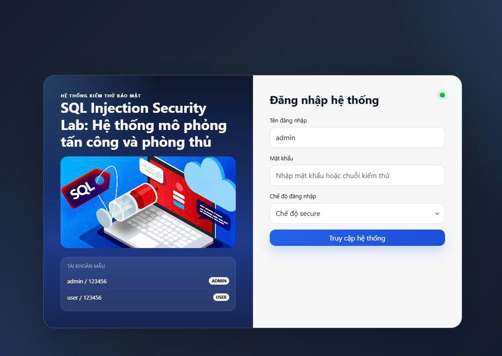
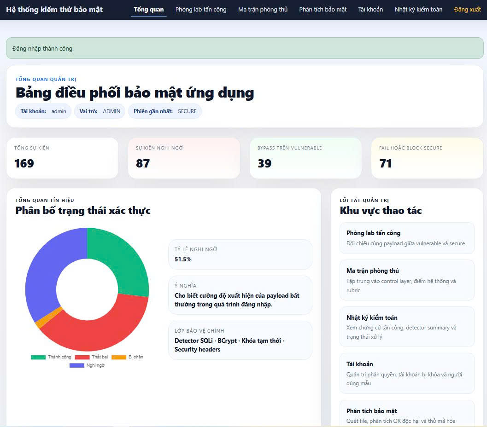
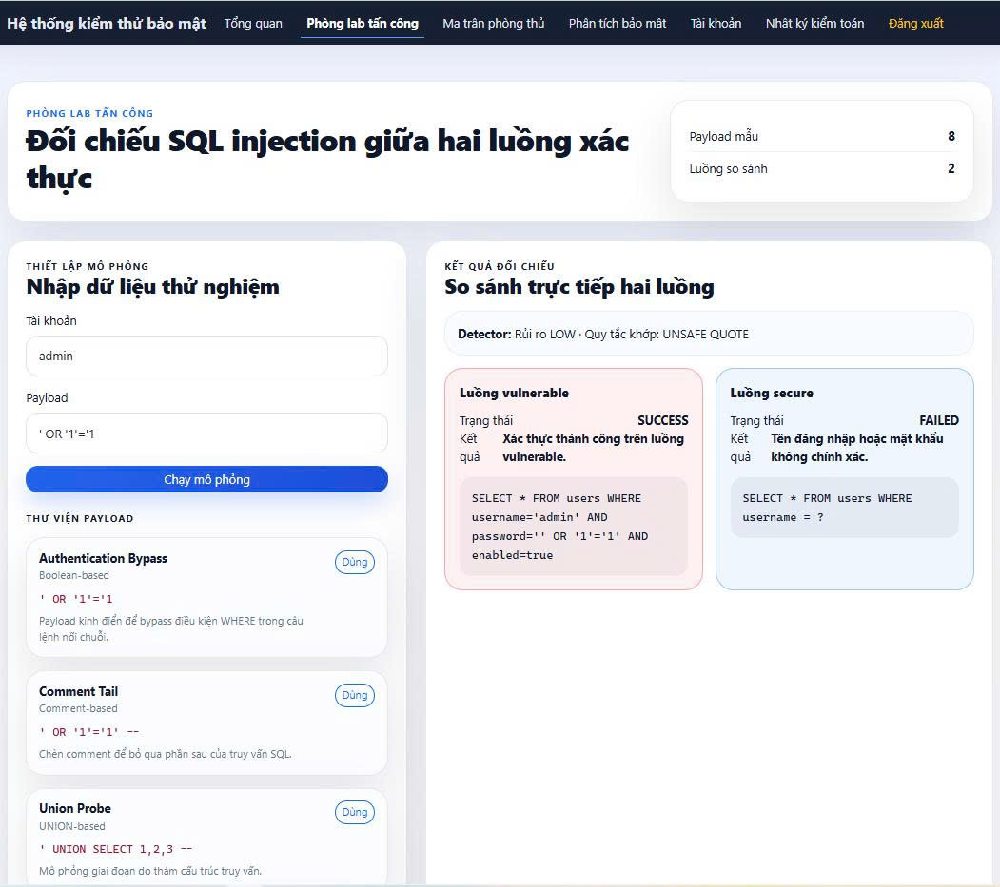
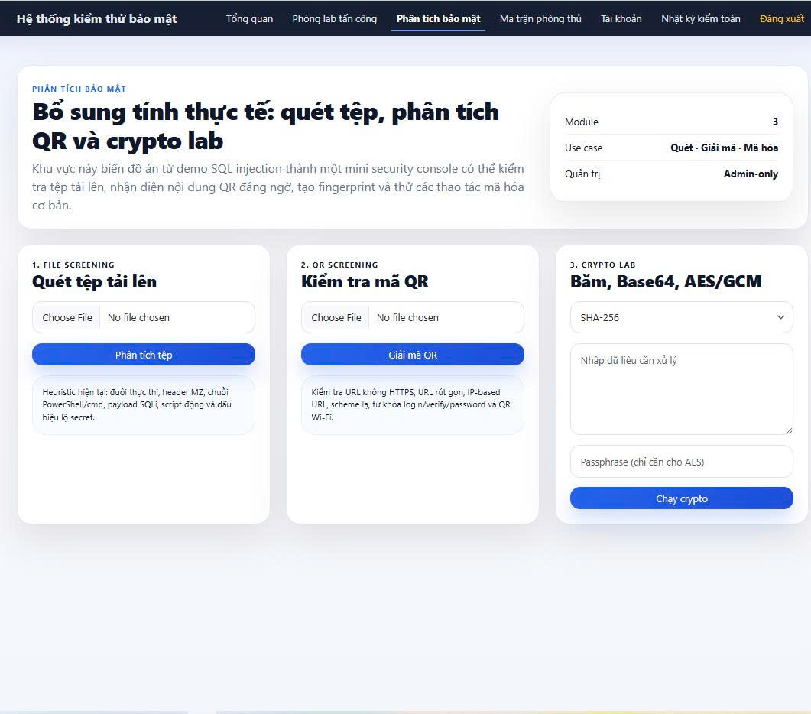
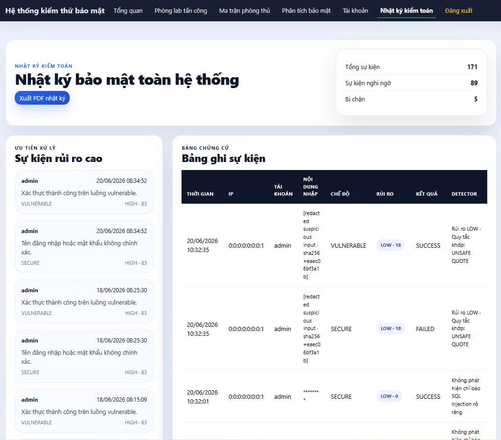
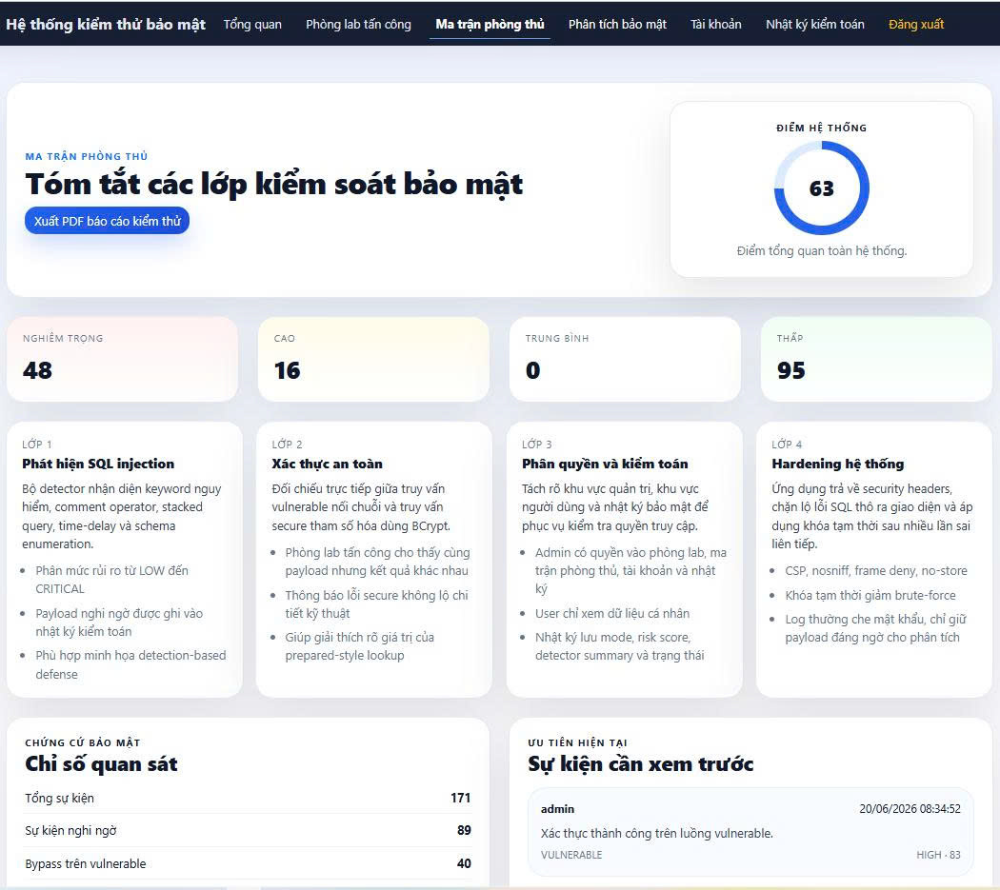
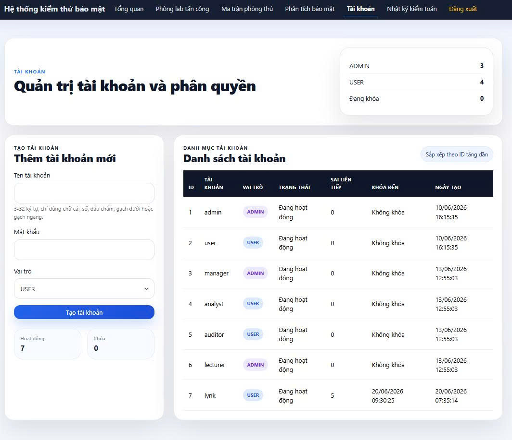

<p align="center">
  
</p>

<h1 align="center">
SQL Injection Security Lab
</h1>

<p align="center">
Mô phỏng tấn công SQL Injection và các cơ chế phòng thủ bằng Spring Boot & MySQL
</p>

<p align="center">
  
</p>

<h1 align="center">
SQL Injection Security Lab
</h1>

<p align="center">
Hệ thống mô phỏng tấn công SQL Injection và các cơ chế bảo mật ứng dụng Web bằng Spring Boot & MySQL
</p>

## 👥 THÀNH VIÊN

* Nguyễn Thị Thu Giang - 23010871
* Ngô Thị Minh Phương - 23012156
* Hoàng Vân Quỳnh - 23010836
* Nguyễn Bá Đức - 23010765

---

# 🛡️ Giới thiệu dự án

**SQL Injection Security Lab** là một hệ thống mô phỏng môi trường học tập về bảo mật ứng dụng Web, tập trung vào việc phân tích lỗ hổng **SQL Injection** và triển khai các cơ chế phòng thủ an toàn.

Dự án được xây dựng bằng **Spring Boot + MySQL**, cho phép người dùng:

* Thực hiện mô phỏng các cuộc tấn công SQL Injection.
* Quan sát sự khác biệt giữa truy vấn không an toàn và truy vấn bảo mật.
* Kiểm tra khả năng phát hiện payload nguy hiểm.
* Theo dõi nhật ký bảo mật.
* Đánh giá mức độ an toàn của hệ thống.

Mục tiêu chính của hệ thống là hỗ trợ học tập môn **An toàn thông tin / Bảo mật hệ thống thông tin**, giúp người học hiểu rõ cách một ứng dụng Web có thể bị khai thác và cách xây dựng hệ thống phòng thủ.

---

# 🎯 Mục tiêu dự án

* Minh họa nguyên lý hoạt động của SQL Injection.
* Mô phỏng các dạng tấn công phổ biến.
* So sánh Vulnerable Mode và Secure Mode.
* Áp dụng Secure Coding trong phát triển Web.
* Xây dựng hệ thống đánh giá và giám sát bảo mật.
* Hỗ trợ thực hành theo hướng OWASP.

---

# ✨ Chức năng hệ thống

## 🔐 Authentication System

Chức năng đăng nhập hệ thống:

* Đăng nhập User/Admin.
* Quản lý phiên đăng nhập.
* Mã hóa mật khẩu bằng BCrypt.
* Kiểm tra bảo mật thông tin tài khoản.
* Hỗ trợ xác thực hai bước (Two Factor Authentication).

---

# ⚔️ Attack Lab

Môi trường mô phỏng SQL Injection.

Bao gồm:

### Login Bypass

Mô phỏng tấn công vượt qua xác thực bằng payload SQL Injection.

Ví dụ:

```
' OR '1'='1
```

---

### Boolean Based Injection

Kiểm tra phản hồi ứng dụng dựa trên điều kiện SQL đúng/sai.

---

### UNION Injection

Mô phỏng truy vấn UNION nhằm khai thác dữ liệu.

---

### Vulnerable Mode

Sử dụng truy vấn SQL không an toàn nhằm minh họa lỗ hổng.

---

### Secure Mode

Áp dụng:

* Prepared Statement.
* Parameterized Query.
* Input Validation.

Nhằm ngăn chặn SQL Injection.

---

# 🛡️ Security Workbench

Khu vực kiểm thử bảo mật với các chức năng:

* Phân tích payload.
* Kiểm tra mức độ nguy hiểm.
* Mô phỏng hành vi tấn công.
* Kiểm tra file.
* Đánh giá cơ chế bảo vệ.

---

# 🔍 SQL Injection Detector

Hệ thống phát hiện các mẫu truy vấn nguy hiểm:

* SELECT
* UNION
* OR
* DROP
* DELETE
* UPDATE

Kết quả đánh giá:

| Mức độ    | Ý nghĩa                      |
| --------- | ---------------------------- |
| SAFE      | Không phát hiện nguy hiểm    |
| WARNING   | Có dấu hiệu bất thường       |
| DANGEROUS | Payload có khả năng tấn công |

---

# 📋 Audit Logging

Hệ thống lưu lại toàn bộ hoạt động bảo mật:

Thông tin ghi nhận:

* Người dùng.
* IP truy cập.
* Payload gửi lên.
* Loại kiểm thử.
* Thời gian.
* Kết quả.

Ứng dụng:

* Theo dõi sự cố.
* Điều tra tấn công.
* Phân tích hành vi.

---

# 📊 Dashboard

Dashboard hiển thị:

* Tổng số lượt kiểm thử.
* Số lượng cảnh báo bảo mật.
* Thống kê người dùng.
* Thống kê log.
* Tổng quan trạng thái hệ thống.

---

# 🧩 Defense Matrix

Ma trận phòng thủ giúp so sánh các kỹ thuật bảo mật:

Bao gồm:

* Parameterized Query.
* Password Hashing.
* Input Validation.
* Secure Authentication.
* Audit Logging.

---

# 🖥️ SOC Mini Dashboard

Hệ thống hỗ trợ mô phỏng giám sát bảo mật:

Chức năng:

* Theo dõi sự kiện.
* Hiển thị cảnh báo.
* Phân tích log.
* Quan sát hoạt động đáng ngờ.

---

# 📄 Báo cáo bảo mật PDF

Hệ thống hỗ trợ tạo báo cáo:

* Security Assessment Report.
* Audit Trail Report.

Báo cáo phục vụ việc:

* Đánh giá hệ thống.
* Lưu trữ kết quả kiểm thử.

---

# 🚀 Công nghệ sử dụng

## Backend

* Java 17
* Spring Boot 3.3.1
* Spring MVC
* Spring Data JPA
* Hibernate

## Database

* MySQL 8.4

## Frontend

* Thymeleaf
* HTML5
* CSS3
* Bootstrap

## Security

* BCrypt Password Hashing
* Prepared Statement
* Parameterized Query
* Input Validation
* Security Logging

## Tools

* Maven
* Docker
* Docker Compose
* JUnit Test

---

# 🏗️ Kiến trúc hệ thống

```
Browser
   |
Controller Layer
   |
Service Layer
   |
Repository Layer
   |
MySQL Database
```

Cấu trúc package:

```
src/main/java/com/example/sqlinjectiondemo

├── controller
├── service
├── repository
├── entity
├── model
├── config
└── security
```

---

# 🔒 Cơ chế bảo mật

## Vulnerable Mode

Mục đích:

* Minh họa SQL Injection.
* Cho phép thực hành khai thác trong môi trường an toàn.

---

## Secure Mode

Giải pháp:

* Prepared Statement.
* Parameter Binding.
* BCrypt.
* Validation.

Mục tiêu:

* Bảo vệ dữ liệu.
* Ngăn chặn truy vấn độc hại.

---

# 👤 Tài khoản mẫu

## Admin

```
username:
admin

password:
123456
```

## User

```
username:
user

password:
123456
```

---

# ⚙️ Cài đặt

## Clone repository

```bash
git clone https://github.com/mfuongg/sql-injection-security-lab.git

cd sql-injection-security-lab
```

---

# 🐳 Chạy bằng Docker

```bash
docker-compose up --build
```

Sau khi chạy:

```
http://localhost:8080
```

---

# 🗄️ Database

Database mặc định:

```
sql_injection_demo
```

Docker tự động import:

```
db/mysql_setup.sql
```

---

# 🧪 Kiểm thử

Chạy test:

```bash
mvn test
```

---

# 📌 Kết quả đạt được

* Xây dựng thành công môi trường mô phỏng SQL Injection.
* Minh họa Vulnerable và Secure Mode.
* Triển khai cơ chế bảo vệ SQL Injection.
* Xây dựng hệ thống phát hiện payload.
* Ghi nhận log bảo mật.
* Tạo báo cáo PDF.
* Hỗ trợ học tập và nghiên cứu bảo mật Web.

---

# 🔮 Hướng phát triển

Trong tương lai có thể mở rộng:

* Tích hợp Spring Security đầy đủ.
* Bổ sung XSS Lab.
* Bổ sung CSRF Lab.
* API Security Testing.
* Tích hợp OWASP ZAP.
* Xây dựng hệ thống SIEM mini.

---

# 📷 Giao diện hệ thống

## Login

<p align="center">

</p>

## Dashboard

<p align="center">

</p>

## Attack Lab

<p align="center">

</p>

## Security Workbench

<p align="center">

</p>

## Audit Logs

<p align="center">

</p>

## Defense Matrix

<p align="center">

</p>

## User Management

<p align="center">

</p>

## 👥THÀNH VIÊN

* Nguyễn Thị Thu Giang - 23010871
* Ngô Thị Minh Phương - 23012156
* Hoàng Vân Quỳnh - 23010836
* Nguyễn Bá Đức - 23010765

---

## 🛡️Giới thiệu

SQL Injection Security Lab là hệ thống mô phỏng tấn công và phòng chống SQL Injection được xây dựng bằng Spring Boot và MySQL.

Dự án được phát triển nhằm mục đích học tập, nghiên cứu và minh họa các lỗ hổng bảo mật phổ biến trong ứng dụng web, đồng thời cung cấp các cơ chế phòng thủ hiện đại giúp ngăn chặn các cuộc tấn công SQL Injection.

Người dùng có thể trực tiếp thực hành, quan sát và so sánh sự khác biệt giữa ứng dụng có lỗ hổng bảo mật (Vulnerable Mode) và ứng dụng đã được bảo vệ (Secure Mode).

---

## 🎯Mục tiêu của dự án

* Minh họa nguyên lý hoạt động của SQL Injection.
* Mô phỏng các hình thức tấn công phổ biến.
* So sánh giữa truy vấn không an toàn và truy vấn tham số hóa.
* Áp dụng các kỹ thuật bảo mật trong phát triển phần mềm.
* Hỗ trợ học tập môn An toàn và Bảo mật Hệ thống Thông tin.

---

## ✨Chức năng chính

### 🔐Đăng nhập hệ thống

* Xác thực người dùng.
* Phân quyền Admin và User.
* Mã hóa mật khẩu bằng BCrypt.
* Hỗ trợ chế độ Vulnerable và Secure.

---

### ⚔️Attack Lab

Môi trường thực hành SQL Injection cho phép:

* Bypass đăng nhập.
* Comment Injection.
* Boolean-Based Injection.
* UNION Injection.
* Kiểm tra kết quả tấn công.

Người dùng có thể so sánh trực tiếp:

* Vulnerable Mode.
* Secure Mode.

---

### 🛡️Security Workbench

Khu vực kiểm thử bảo mật với các chức năng:

* Phân tích payload SQL Injection.
* Đánh giá mức độ nguy hiểm.
* Mô phỏng các cuộc tấn công.
* So sánh cơ chế phòng thủ.

---

### 🔑SQL Injection Detector

Hệ thống phát hiện các chuỗi đầu vào nguy hiểm như:

* OR
* UNION
* SELECT
* DROP
* DELETE
* UPDATE

Mức độ đánh giá:

* SAFE
* WARNING
* DANGEROUS

---

### 📑Audit Logging

Ghi nhận toàn bộ hoạt động kiểm thử:

* Tài khoản sử dụng
* Địa chỉ IP
* Payload đầu vào
* Chế độ thực thi
* Thời gian thực hiện
* Kết quả kiểm thử

Hỗ trợ:

* Điều tra sự cố
* Theo dõi bảo mật
* Phân tích tấn công

---

### 📊Dashboard

Hiển thị tổng quan hệ thống:

* Số lượng lượt kiểm thử
* Số lần phát hiện tấn công
* Thống kê người dùng
* Thống kê sự kiện bảo mật

---

### 🧩Defense Matrix

Ma trận phòng thủ giúp người học hiểu các cơ chế bảo mật:

* Parameterized Query
* Password Hashing
* Input Validation
* Audit Logging
* Secure Authentication

---

### 📄Báo cáo PDF

Cho phép xuất:

* Security Test Report
* Audit Trail Report

---

## 🚀Công nghệ sử dụng

### Backend

* Java 17
* Spring Boot 3
* Spring Data JPA
* Hibernate

### Database

* MySQL 8

### Frontend

* Thymeleaf
* Bootstrap 5
* HTML5
* CSS3

### Bảo mật

* BCrypt Password Hashing
* Prepared Statement
* Parameterized Query
* Content Security Policy
* Security Headers

### Công cụ triển khai

* Maven
* Docker
* Docker Compose

---

## 🖥️Kiến trúc hệ thống

```text
Controller Layer
       ↓
Service Layer
       ↓
Repository Layer
       ↓
MySQL Database
```

Các package chính:

```text
src/main/java/com/example/sqlinjectiondemo

├── controller
├── service
├── repository
├── entity
├── model
├── security
└── config
```

---

## 🔒Thiết kế bảo mật

### Vulnerable Mode

Sử dụng truy vấn SQL ghép chuỗi trực tiếp.

Mục đích:

* Minh họa lỗ hổng SQL Injection.
* Thực hành tấn công trong môi trường an toàn.

---

### Secure Mode

Sử dụng:

* Prepared Statement
* Parameterized Query
* BCrypt Password Hashing
* Input Validation

Mục đích:

* Ngăn chặn SQL Injection.
* Áp dụng Secure Coding.

---

## 👤Tài khoản mẫu

### Quản trị viên

Tên đăng nhập:

admin

Mật khẩu:

123456

---

### Người dùng

Tên đăng nhập:

user

Mật khẩu:

123456

---

## ⚙️Hướng dẫn cài đặt

### Clone dự án

```bash
git clone https://github.com/mfuongg/sql-injection-security-lab.git
cd sql-injection-security-lab
```

---

### Tạo cơ sở dữ liệu

```sql
CREATE DATABASE sql_injection_demo;
```

---

### Import dữ liệu mẫu

```bash
mysql -u root -p sql_injection_demo < db/mysql_setup.sql
```

---

### Cấu hình kết nối MySQL

Mở file:

```properties
src/main/resources/application.properties
```

Ví dụ:

```properties
spring.datasource.url=jdbc:mysql://localhost:3306/sql_injection_demo
spring.datasource.username=root
spring.datasource.password=your_password
```

---

### Chạy ứng dụng

```bash
mvn clean spring-boot:run
```

Truy cập:

```text
http://localhost:8080
```

---

## 🐳Docker

Khởi chạy bằng Docker:

```bash
docker-compose up --build
```

---

## 📌Kết quả đạt được

* Xây dựng thành công hệ thống mô phỏng SQL Injection.
* Minh họa trực quan sự khác biệt giữa Vulnerable Mode và Secure Mode.
* Áp dụng BCrypt Password Hashing.
* Áp dụng Parameterized Query.
* Xây dựng hệ thống Audit Logging.
* Tích hợp Dashboard và báo cáo PDF.
* Hỗ trợ học tập và thực hành an toàn thông tin.

---

## 📌Hướng phát triển

* Tích hợp Spring Security.
* Bổ sung mô phỏng XSS.
* Bổ sung mô phỏng CSRF.
* Xây dựng REST API Security Lab.
* Mở rộng theo chuẩn OWASP Top 10.

---


## 📷Giao diện hệ thống

### Trang đăng nhập

<p align="center">
  
</p>

### Dashboard

<p align="center">
  
</p>

### Attack Lab

<p align="center">
  
</p>

### Security Workbench

<p align="center">
  
</p>

### Audit Logs

<p align="center">
  
</p>

### Defense Matrix

<p align="center">
  
</p>

### Quản lý người dùng

<p align="center">
  
</p>
